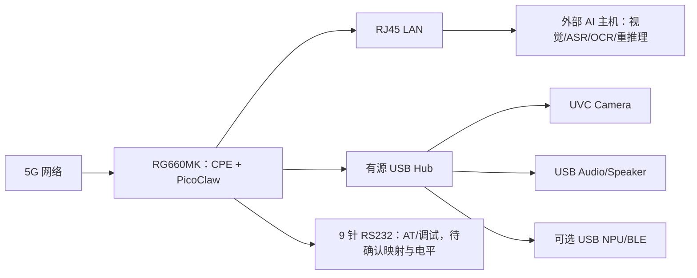

# RG660MK AI CPE Demo：PicoClaw 部署与 SG560D AI Assistant 迁移设计

- 文档版本：V1.0
- 编制日期：2026-08-19
- 执行环境：Ubuntu 主机 + RG660MK-JP 样机
- 目标目录：`/home/jedyying/Downloads/AI_CPE_Demo`
- 旧工程：SG560D AI Assistant 收尾归档（只读输入）
- 执行者：Claude Code

---

## 0. 给 Claude Code 的总指令

请完整阅读本文后再执行。不要重新设计项目，也不要跳过 Gate。

你的任务是：在**不刷机、不分区、不格式化、不破坏 RG660MK 现有 CPE 功能、不改写 SG560D 归档**的前提下，先建立 RG660MK 的 5G CPE 基线，再在 RG660MK 上部署可回滚的 PicoClaw，最后按优先级迁移 SG560D 已验证的 AI Assistant 功能。

执行规则：

1. 先做只读盘点，再做备份，再允许变更。
2. 每一阶段必须生成：执行命令、原始日志、关键结论、PASS/FAIL、回滚方法。
3. 前一 Gate 未 PASS，不得进入下一 Gate；遇到未知串口、未知分区、未知电平或未知启动机制时停止，不得猜测。
4. 不得移动、删除、覆盖或批量格式化旧归档；不要直接把旧 `config.json` 覆盖到新 PicoClaw。
5. 不得执行 `dd`、`mkfs*`、`fdisk`、`parted`、刷写固件、恢复出厂、清空分区、递归删除或未经确认的系统升级。
6. 不得在日志、报告、终端回显中输出 API Key、Token、Wi-Fi 密码、SIM/APN 密码。发现密钥时只记录文件位置和“已配置/未配置”，值必须脱敏。
7. 任何网络改动必须先导出当前配置，并准备单命令回滚；不得把 PicoClaw 管理端口暴露到蜂窝 WAN。
8. 只迁移“能力与代码”，不默认二进制兼容。SG560D 的 Qualcomm QNN/HTP、Android TTS 和 ARM64 APK 不能直接视为可在 MediaTek T930/Linux 上复用。
9. PicoClaw 当前仍处于快速开发期，必须固定实际使用的 release/tag、下载 URL、SHA-256 和配置 schema，不允许用无法复现的“latest”作为最终交付版本。
10. 每完成一个 Gate，先更新 `STATUS.md`，再继续。

最终需要在 `/home/jedyying/Downloads/AI_CPE_Demo` 形成可复现交付包，而不是只在终端中临时跑通。

---

## 1. 项目背景与已知事实

### 1.1 旧 SG560D 归档

历史记录显示，实际归档路径很可能是：

```text
/home/jedyying/Downloads/SG560D_AI_Assistant_APK备份/SG560D_AI_Assistant_收尾归档_20260717_153422
```

用户本次输入的路径少了一个 `/`，写成了：

```text
/home/jedyying/Downloads/SG560D_AI_Assistant_APK备份SG560D_AI_Assistant_收尾归档_20260717_153422
```

Claude Code 必须检查两个候选路径，以真实存在且含总索引/功能目录的路径为 `SRC_ROOT`；不得自行新建一个空的“旧工程目录”掩盖路径错误。若两个路径都不存在，Gate 0 直接 FAIL 并停止。

旧归档已知包含：

- 连续对话、本地 TTS、PicoClaw；
- 微信通道；
- 摄像头、人脸检测；
- Immich；
- YOLO/QNN；
- Qwen 视觉；
- MediaPipe；
- Matter/ChipTool；
- 涂鸦 MQTT；
- Home Assistant；
- Paraformer ASR、VAD、KWS；
- APK、设备环境、测试日志和设计文档。

已在 SG560D 上得到过的关键结果：

- V2.2 本地意图与 ASR 容错 APK 可经 ADB 安装；
- 连续对话与播报达到“基本 PASS”，仍存在少量简单问题识别误差；
- “拍照 → C++ 人脸检测 → MQTT 1883 → 开/关灯”闭环曾经打通，采用约 3 秒轮询、2 轮冷却，MQTT broker 可自恢复；
- SG560D 工作区曾位于 `/data/local/tmp/picoclaw/home/.picoclaw/workspace/`。

必须保留的历史失败/限制：

- Qualcomm TTS Service 虽注册了扬声器，但 V12 `TextToSpeech` 初始化曾返回 `status=-1`；
- “Ubuntu edge-tts 生成 MP3 → adb → MediaStore → AudioPreview”只做过尝试，未形成完成证据；
- 历史 Qwen Key 曾出现 401/blocked/额度耗尽，不能复制旧密钥并把它视为可用；
- 旧归档中的“存在文件”不等于“功能已验证”，必须以日志、脚本和测试结果交叉确认。

### 1.2 RG660MK 当前已知状态

- RG660MK 基于 MediaTek T930 平台，核心定位是 5G-A/CPE；不能把 SG560D 的 Qualcomm QCM6490/QNN 运行环境照搬过来。
- 本模块没有可直接依赖的蓝牙、内置 Speaker、Camera，也不能默认已开放通用 NPU SDK。
- 可利用的外部接口：一个 USB、9 针 RS232/UART 相关接口、RJ45。
- 历史上 Ubuntu 曾将 RG660MK 的 B 分区挂载到 `/mnt/rg660mk_b`，ext4、约 54 GB。
- 当时发现 `PicoClaw` 目录约 12 KB、`pico-a5` 为 0 字节，只能说明有占位，**不能说明 PicoClaw 已部署**。
- B 分区曾存在约 26 MB 的 `rg660mk/picoclaw`、`rg660mk/picoclaw-data`、`rg660mk/test_picoclaw_install.sh` 等材料，应先只读审计，不能直接运行。
- 历史记录出现过 `mount /dev/mmcblk1p1 /mnt/sdcard`，但本次必须重新确认块设备、文件系统、UUID、挂载点和启动后的实际路径，严禁依据旧记录格式化或盲目挂载。

### 1.3 本次最小成功定义

“完成第一阶段”必须同时满足：

1. RG660MK 能注册蜂窝网络并建立数据连接；
2. RJ45 下游客户端能自动获取地址、解析 DNS、访问互联网；
3. NAT/转发、默认路由和防火墙行为有证据；
4. PicoClaw 在 RG660MK 上以前台方式运行，能完成一次文本请求；
5. PicoClaw 重启后可恢复，且不改变 CPE 的 WAN/LAN/路由/DNS；
6. 连续运行至少 30 分钟，无异常重启、内存持续增长或 CPE 断网；
7. 有完整日志、版本、配置模板、安装脚本和回滚脚本。

摄像头、Speaker、NPU、蓝牙和所有旧 AI 功能属于后续迁移 Gate，不得拿它们替代 CPE/PicoClaw 基线。

---

## 2. 总体架构

推荐采用“RG660MK 做连接与轻量代理，RJ45 外部 AI 主机做重推理，USB 做受控外设扩展”的分层设计。



职责边界：

| 组件 | 主要职责 | 禁止假设 |
| --- | --- | --- |
| RG660MK | 5G 接入、CPE、NAT/DHCP/DNS、PicoClaw、MQTT/HTTP 编排 | 不默认可运行 Qualcomm QNN，不默认有蓝牙/音频/摄像头驱动 |
| PicoClaw | 轻量 Agent、对话编排、渠道、调用外部工具/API | 不承担本地大模型或重视觉推理 |
| RJ45 外部 AI 主机 | Camera、OCR、YOLO、人脸、Paraformer、复杂 ASR/视觉 | 不接管或破坏 RG660MK 的 CPE 路由职责 |
| 有源 USB Hub | 扩展单 USB 口并独立供电 | 不默认 RG660MK USB 是 USB 3.x/Host 模式 |
| RS232 | 可能承载 AT/Console | 不默认 9 针口就是模块 AT UART，不默认 TTL 电平 |

---

## 3. 交付目录与证据规范

Claude Code 首先创建：

```text
/home/jedyying/Downloads/AI_CPE_Demo/
├── 00_design/
├── 01_inventory/
│   ├── host/
│   ├── sg560d_archive/
│   └── rg660mk/
├── 02_cpe_baseline/
├── 03_picoclaw/
│   ├── package/
│   ├── config_template/
│   ├── service/
│   └── logs/
├── 04_migration_matrix/
├── 05_features/
├── 06_tests/
├── 07_scripts/
├── 08_logs/
├── 09_rollback/
├── STATUS.md
├── DECISIONS.md
├── CHANGELOG.md
└── MANIFEST.sha256
```

每个 Gate 的报告至少包含：

```text
目标：
时间：
设备/固件/内核版本：
执行命令：
原始输出文件：
关键证据：
判定：PASS / FAIL / BLOCKED
未解决问题：
对现有 CPE 的影响：
回滚方法：
下一 Gate 是否允许开始：YES / NO
```

日志命名统一使用 `YYYYMMDD_HHMMSS_阶段_内容.log`。报告中的密钥、手机号、IMSI、ICCID、公网 IP 按需脱敏。

---

## 4. Gate 0：只读盘点、路径确认与安全备份

### 4.1 目标

- 找到真实 SG560D 归档；
- 确认 Ubuntu 与 RG660MK 的连接方式；
- 确认 RG660MK OS、CPU 架构、libc、内存、存储、启动系统、USB 模式；
- 在不修改设备的前提下记录基线；
- 对现有 PicoClaw 占位材料做静态审计。

### 4.2 主机侧起始命令

以下命令可作为 Claude Code 的起点；若环境不同，应解释并调整，不得静默跳过。

```bash
set -u

DEST_ROOT='/home/jedyying/Downloads/AI_CPE_Demo'
SRC_A='/home/jedyying/Downloads/SG560D_AI_Assistant_APK备份/SG560D_AI_Assistant_收尾归档_20260717_153422'
SRC_B='/home/jedyying/Downloads/SG560D_AI_Assistant_APK备份SG560D_AI_Assistant_收尾归档_20260717_153422'

mkdir -p "$DEST_ROOT"/{00_design,01_inventory/{host,sg560d_archive,rg660mk},02_cpe_baseline,03_picoclaw/{package,config_template,service,logs},04_migration_matrix,05_features,06_tests,07_scripts,08_logs,09_rollback}

for p in "$SRC_A" "$SRC_B"; do
  if [ -d "$p" ]; then
    printf 'FOUND\t%s\n' "$p"
  else
    printf 'MISSING\t%s\n' "$p"
  fi
done | tee "$DEST_ROOT/01_inventory/sg560d_archive/source_candidates.txt"
```

确定唯一 `SRC_ROOT` 后，只读记录：

```bash
find "$SRC_ROOT" -xdev -printf '%y\t%M\t%s\t%TY-%Tm-%Td %TH:%TM:%TS\t%p\n' \
  > "$DEST_ROOT/01_inventory/sg560d_archive/file_inventory.tsv"

du -sh "$SRC_ROOT" \
  > "$DEST_ROOT/01_inventory/sg560d_archive/total_size.txt"

find "$SRC_ROOT" -xdev -type f -print0 \
  | sort -z \
  | xargs -0 sha256sum \
  > "$DEST_ROOT/01_inventory/sg560d_archive/SHA256SUMS.txt"
```

如果归档过大，可先完成文件清单和关键文件哈希作为 quick pass，再后台完成全量 SHA-256；必须在报告中标注哪一种已完成。

### 4.3 旧工程结构审计

只读取以下信息，不修改源目录：

- 总索引、README、收尾报告、测试结论；
- APK 名称、版本、包名、签名、ABI、min/target SDK；
- Gradle/Android Studio 工程是否存在；
- C/C++、Python、Shell、模型、配置、服务脚本；
- MQTT topic、REST API、端口、进程间协议；
- 设备依赖：Android Framework、ADB、QNN/HTP、Camera2、MediaStore、ALSA、V4L2、蓝牙、GPIO；
- 已验证日志与未完成 TODO。

输出 `04_migration_matrix/SG560D_evidence_matrix.csv`，至少含：

```text
功能,源文件/目录,已有成功证据,已有失败证据,运行平台依赖,RG660MK可直接复用,需重编译,需重写,需外部主机,优先级
```

不要将“目录存在”“APK 能安装”“代码能编译”误写成“端到端功能 PASS”。

### 4.4 RG660MK 连接与系统盘点

依次检测，但不要假设一定使用 ADB：

1. USB 枚举：`lsusb`、`lsusb -t`、`dmesg --ctime`；
2. 网口邻居和地址：`ip -br link`、`ip -br addr`、`ip route`、`ip neigh`；
3. ADB：仅在已枚举 Android/ADB 接口时运行 `adb devices -l`；
4. SSH：仅在已知设备 IP/端口时连接；
5. 串口：枚举 `/dev/ttyUSB*`、`/dev/ttyACM*`，结合 VID/PID 和已有资料确认用途；禁止向未知串口发送命令。

登录 RG660MK 后收集：

```bash
uname -a
uname -m
cat /etc/os-release 2>/dev/null || true
getprop ro.product.cpu.abi 2>/dev/null || true
getprop ro.build.version.release 2>/dev/null || true
getconf LONG_BIT 2>/dev/null || true
ldd --version 2>&1 | head -n 2 || true
busybox 2>/dev/null | head -n 2 || true
id
df -hT
mount
cat /proc/meminfo
cat /proc/cpuinfo
cat /proc/cmdline
ps
ip -br link
ip -br addr
ip route
ip rule
```

另外记录：

- 当前用户是否有 root；
- 可写且重启后持久的分区；
- 分区 UUID/文件系统/挂载参数；
- `systemd`、`procd`、BusyBox init 或 Android init 中哪一种存在；
- 是否有 `curl/wget/tar/sha256sum/file/readelf`；
- 是否允许在可写分区执行 ELF（是否存在 `noexec`）；
- USB 是否为 Host、速度是 480M 还是 5G/10G、已加载哪些 UVC/ALSA/BLE 驱动；
- 防火墙使用 nftables、iptables 还是厂商网络管理组件。

### 4.5 对历史 RG660MK PicoClaw 材料的静态审计

若 `/mnt/rg660mk_b` 或设备持久分区仍可见：

- 先记录挂载源、挂载参数、容量；
- 对 `PicoClaw`、`pico-a5`、`rg660mk/picoclaw*` 做 `ls -la`、`file`、SHA-256；
- 只读取脚本内容，检查是否含刷机、分区、覆盖系统目录、下载不明二进制、明文密钥；
- `pico-a5` 为 0 字节时明确标记为占位；
- 旧脚本未通过审计前不得执行。

### 4.6 Gate 0 PASS 条件

- 唯一 `SRC_ROOT` 已确认；
- 旧工程没有被修改；
- RG660MK 的访问方式、OS/arch/libc、可写持久分区和 init 系统已确认；
- CPE 当前配置已有备份或只读导出；
- 旧 PicoClaw 材料已被判定为“可用/不可用/待确认”；
- `01_inventory/GATE0_REPORT.md` 完成。

---

## 5. Gate 1：RG660MK CPE 基线验证

### 5.1 原则

先证明 RG660MK 是正常 CPE，再安装 PicoClaw。若 CPE 本身不通，禁止把问题归因于 PicoClaw，也禁止用安装 PicoClaw 掩盖网络问题。

### 5.2 验证层次

#### A. Modem/蜂窝侧

记录但不修改：

- SIM 是否就绪；
- 运营商、RAT（5G SA/NSA/LTE）、注册状态；
- APN/PDP 上下文；
- 蜂窝接口 IP、默认路由、DNS；
- 信号质量；
- 数据连接重连状态。

若确认某个串口为 AT 口，先备份串口参数，再只运行查询类命令，例如 `ATI`、`AT+CPIN?`、`AT+CEREG?`、`AT+CGATT?`、`AT+CGPADDR`、`AT+CSQ`。只有在厂商文档明确支持时才使用其他命令。不得向未知 Console/GNSS/DIAG 端口发送 AT。

#### B. RG660MK 本机联网

验证：

- 能 ping 本机默认网关；
- 能按域名解析；
- 能建立 HTTPS；
- IPv4/IPv6 分开记录；
- 默认路由来自蜂窝 WAN，而不是调试 USB/RJ45 的错误路由。

#### C. RJ45 下游 CPE 功能

连接一台 Ubuntu 客户端到 RJ45：

- Link detected；
- 客户端通过 DHCP 获得 LAN 地址、网关、DNS；
- 能 ping RG660MK LAN 地址；
- 能解析域名并访问互联网；
- `traceroute` 第一跳是 RG660MK；
- NAT/forward 计数有变化；
- 管理页面/SSH 不暴露到蜂窝 WAN。

#### D. 稳定性与性能基线

在未运行 PicoClaw 时记录：

- 30 分钟连续 ping 的丢包率、平均/95 分位延迟；
- 可用条件下的下载/上传吞吐；
- CPU、内存、温度；
- WAN IP/RAT 切换和断线次数；
- DHCP 租约与 DNS 情况。

不要为了追求速度改 APN、频段锁定、MTU 或防火墙。若必须变更，只能在报告中提出，不要擅自执行。

### 5.3 CPE PASS 标准

| 项目 | PASS 标准 |
| --- | --- |
| 蜂窝注册 | SIM 就绪，已注册 LTE/5G，数据上下文已建立 |
| RG 本机联网 | DNS 与 HTTPS 可用 |
| RJ45 DHCP | 下游客户端自动获得合法 LAN 地址、网关、DNS |
| NAT/转发 | 下游客户端可通过蜂窝 WAN 上网 |
| 稳定性 | 30 分钟无异常掉线；丢包和延迟有原始日志 |
| 安全 | 管理服务未绑定蜂窝 WAN；无新增开放端口 |
| 可回滚 | 当前网络配置已备份，变更为零或有明确回滚 |

Gate 1 输出：`02_cpe_baseline/GATE1_CPE_BASELINE_REPORT.md`。任何一项失败均不得进入 Gate 2。

---

## 6. Gate 2：PicoClaw 安全、可回滚部署

### 6.1 版本与安装路线

PicoClaw 官方提供 Linux ARM64 预编译包，也支持 Go 源码构建；配置根目录可由 `PICOCLAW_HOME` 指定，配置文件可由 `PICOCLAW_CONFIG` 指定。

实际安装路线按以下顺序选择：

1. 若 RG660MK 是 `aarch64/arm64` Linux，先在 Ubuntu 下载官方 release 包；
2. 固定 release/tag，保存下载 URL、release 页面、文件大小与 SHA-256；
3. 在 Ubuntu 上先用 `file`、`readelf`、`ldd`/ELF interpreter 检查；
4. 将二进制放入 RG660MK 的独立 staging 目录，先执行 `picoclaw version`/`--help`；
5. 若出现 `not found`、动态加载器缺失、glibc/musl/bionic 不兼容，停止直接安装；
6. 再考虑从同一固定 tag 以 `CGO_ENABLED=0` 交叉编译，或采用官方 Android 路线；不得从第三方网盘下载不明二进制。

不要把下载得到的二进制直接覆盖 `/usr/bin`、`/usr/local/bin` 或厂商目录。初始安装建议使用持久分区内的版本化路径，例如：

```text
<PERSIST_ROOT>/ai_cpe/picoclaw/releases/<version>/picoclaw
<PERSIST_ROOT>/ai_cpe/picoclaw/current -> releases/<version>
<PERSIST_ROOT>/ai_cpe/picoclaw/home/
<PERSIST_ROOT>/ai_cpe/picoclaw/config/
<PERSIST_ROOT>/ai_cpe/picoclaw/logs/
```

`<PERSIST_ROOT>` 必须由 Gate 0 的实际结果决定；不能未经确认硬编码为 `/mnt/sdcard`。

### 6.2 配置迁移原则

- 新版本先运行 `onboard` 生成新 schema；
- 从 SG560D 旧配置中逐项迁移 provider、channel、workspace、system prompt 和工具配置；
- 不复制历史 session/cache/runtime PID；
- 不复制旧 Qwen Key；
- 新密钥写入权限为 `0600` 的独立环境/密钥文件，配置模板只保留占位符；
- 首次 gateway 只监听 `127.0.0.1`；
- 需要 LAN 访问时，绑定 RG660MK 的明确 LAN 地址并增加防火墙白名单，禁止直接监听蜂窝 WAN 或无差别暴露 `0.0.0.0`。

建议运行环境：

```bash
export PICOCLAW_HOME='<PERSIST_ROOT>/ai_cpe/picoclaw/home'
export PICOCLAW_CONFIG='<PERSIST_ROOT>/ai_cpe/picoclaw/config/config.json'
```

### 6.3 前台冒烟测试

按顺序验证：

1. 二进制能运行，版本与 SHA-256 匹配；
2. `onboard` 可生成配置，目录权限正确；
3. 使用最小配置，不启用微信、摄像头、Shell 高权限工具；
4. 完成一次文本请求并保留去密钥日志；
5. 终止进程后网络路由、DNS、NAT 与 Gate 1 一致；
6. 前台运行 30 分钟，记录 RSS、CPU、FD、线程、网络连接。

资源验收建议：

- 空闲时不应持续占满一个 CPU；
- RSS 应稳定，不应持续单调增长；
- 最小文本模式以 100 MB RSS 为告警线，不把官方宣传的 `<10 MB` 当作硬性事实，因为不同版本和功能启用后可能更高；
- PicoClaw 不应创建新的默认路由、DHCP 服务或修改 CPE 防火墙。

### 6.4 服务化

只有前台测试 PASS 后才能服务化：

- `systemd`：创建独立 unit，使用普通用户、固定工作目录、环境文件和自动重启限制；
- `procd`：创建 OpenWrt 风格 init 脚本；
- BusyBox/SysV：创建可禁用的 `/etc/init.d` 脚本；
- Android init：除非有厂商 SDK/可写 overlay，不直接修改只读 `init*.rc`；优先使用厂商允许的启动钩子。

必须提供：

- `start_picoclaw.sh`；
- `stop_picoclaw.sh`；
- `healthcheck_picoclaw.sh`；
- `rollback_picoclaw.sh`；
- 服务状态与日志查看说明。

启动失败不得无限快速重启；建议限制重试并保留最后日志。服务必须在蜂窝/RJ45 网络准备完成后启动，但不能阻塞 CPE 启动。

### 6.5 Gate 2 PASS 条件

- 固定版本 PicoClaw 在 RG660MK 本机运行；
- 版本、来源、SHA-256、架构和 libc 兼容证据齐全；
- 完成最小文本请求；
- 30 分钟资源稳定；
- 停止/重启 PicoClaw 不影响 CPE；
- 可禁用、可卸载、可回滚；
- `03_picoclaw/GATE2_PICOCLAW_REPORT.md` 完成。

---

## 7. Gate 3：SG560D 功能迁移矩阵与实施优先级

### 7.1 总体原则

先迁移网络协议和业务逻辑，再迁移 Android/Qualcomm 硬件相关代码。每个功能必须被归类为：

- A：RG660MK 可直接运行；
- B：需 ARM64/Linux 重编译；
- C：需替换平台 API；
- D：应迁移到 RJ45 外部 AI 主机；
- E：缺硬件/SDK，当前阻塞。

### 7.2 初始迁移判断

| 功能 | SG560D 状态 | RG660MK 初步路线 | 关键验收 |
| --- | --- | --- | --- |
| PicoClaw 文本对话 | 已有工作区/历史能力 | Gate 2 原生 ARM64 Linux 部署，逐项迁移配置 | 文本请求、会话持久化、重启恢复 |
| V2.2 APK 本地意图/ASR 容错 | APK 可安装 | 先检查是否有 Android；无 Android 时抽取规则/协议，重写为 PicoClaw tool/service | 固定测试集正确率与 SG 基线对比 |
| 连续对话 | 基本 PASS | PicoClaw 编排 + 外部 ASR/TTS；不要假设旧 APK 可直接跑 | 连续 10 轮、可打断、错误可恢复 |
| 本地 TTS | 历史有失败 | USB Audio + Linux ALSA/TTS，或 RJ45 音频服务 | 10 条播报、无崩溃、延迟记录 |
| Paraformer/VAD/KWS | 有归档 | 轻量部分可交叉编译；模型推理优先外部 AI 主机 | 唤醒、端点检测、WER/延迟 |
| 摄像头 | SG 有 Camera 路线 | RG 使用 UVC；单 USB 时先 720p MJPEG | `v4l2-ctl` 枚举、连续采帧 30 分钟 |
| C++ 人脸→MQTT→灯 | 曾端到端 PASS | 保留 MQTT 协议；人脸推理优先 RJ45 外部主机 | 3 秒轮询/2 轮冷却行为一致 |
| YOLO/QNN/HTP | Qualcomm 相关 | QNN/HTP 不可直接复用；改 MediaTek SDK 或 Jetson/Coral | 模型结果、FPS、CPU/温度 |
| Qwen 视觉 | 旧 Key 失效 | 使用新 provider 凭据或外部视觉服务 | 统一图片集、成功率/错误处理 |
| MediaPipe | 有归档 | 检查 Linux ARM64 支持，通常重编译或外置 | 关键点输出与性能 |
| Immich | 网络服务 | 迁移 REST/API/上传逻辑，RG 只做编排 | 上传、检索、失败重试 |
| 涂鸦 MQTT | 网络协议 | 可优先迁移，密钥外置 | topic/payload、重连、幂等 |
| Home Assistant | 网络协议 | 可优先迁移 MQTT/REST | 实体状态与命令闭环 |
| Matter/ChipTool | 平台相关 | Linux ARM64 重编译；BLE/Thread 配网需外设 | 配网、发现、控制、重启恢复 |
| 微信通道 | 有归档 | 与当前 PicoClaw channel schema 对齐，最后启用 | 收发、断线重连、Token 脱敏 |

此表是规划，不是最终结论。Claude Code 必须用 Gate 0 的真实源文件和 RG 系统盘点更新它。

### 7.3 优先级

#### P0：必须先完成

1. CPE 基线；
2. PicoClaw 文本对话；
3. 服务化、日志、回滚；
4. MQTT/Home Assistant/涂鸦等纯网络能力。

#### P1：Demo 核心闭环

1. UVC 摄像头或 RJ45 摄像头服务；
2. 人脸/视觉 → MQTT → 灯光；
3. USB Speaker/TTS；
4. 连续对话、VAD/KWS/ASR。

#### P2：算力和平台适配

1. YOLO/MediaPipe；
2. Matter/ChipTool；
3. Immich/Qwen 视觉；
4. 微信等外部渠道。

#### P3：可选扩展

- BLE；
- Coral/Jetson NPU 加速；
- 多摄像头或 1080p 高帧率；
- 本地模型和复杂并发。

---

## 8. 外设与接口专项设计

### 8.1 单 USB 口

先用 `lsusb -t`、内核日志和板卡资料确认：

- USB 是否工作在 Host 模式；
- 实际是 USB 2.0 还是 USB 3.x；
- 最大供电电流；
- 内核是否有 UVC、USB Audio、HID、CDC、BLE 和目标 NPU 驱动。

推荐使用有源 USB Hub，Hub 外部供电，不让 RG660MK 同时给 Camera、Speaker 和 NPU 供电。

带宽判断：

- Speaker 音频带宽很小，主要风险是驱动与供电；
- UVC Camera 是持续流量，USB 2.0 下优先 720p/MJPEG；
- USB NPU 不一定持续占用“大带宽”，但 Camera 数据要先进入主机、再送 NPU，同一 Hub 上会形成两段 USB 数据流；
- 如果 Camera + NPU 并发不稳定，优先把二者移到 RJ45 外部 AI 主机，而不是降低 CPE 稳定性。

USB 验收顺序：Hub → Speaker → Camera → BLE/NPU，逐个接入并记录 `dmesg`、`lsusb -t`、供电和 CPE 是否掉线。

### 8.2 9 针 RS232/AT

“9 针”只描述物理接口，不能证明它就是 AT 口。必须从板卡原理图/引脚表确认：

- TX/RX/GND 引脚；
- AT、Console、DIAG 或 GNSS 中哪一种信号被映射；
- RS232 电平还是 1.8 V/3.3 V TTL；
- 波特率、8N1、流控；
- 是否已有板载电平转换器。

连接规则：

- 真 RS232 ↔ USB-RS232 可直接按厂商线序连接；
- TTL UART ↔ 真 RS232 必须使用 MAX3232 等电平转换；
- ESP32-C3 的 UART 是 TTL，不能直接接真 RS232；
- 带 USB 的 ESP32-C3 开发板可以通过 USB 枚举为串口/JTAG，但这不等于其裸 UART 是 USB 或 RS232。

在电平和线序未确认前，不得试接或发送 AT。

### 8.3 RJ45 外部 AI 主机

推荐为外部 AI 主机设置固定 LAN DHCP 租约，并运行独立服务：

- `/health`：健康检查；
- `/asr`：音频转写；
- `/tts`：文本转音频；
- `/vision/detect`：目标/人脸检测；
- `/vision/describe`：视觉理解；
- MQTT：事件和设备控制。

接口必须有超时、重试、幂等标识和明确错误码。PicoClaw 调用失败时只降级 AI 功能，不能影响 DHCP/NAT/蜂窝连接。

### 8.4 NPU 选型边界

- 不把 RG660MK 的“网络处理单元”当作开放给用户模型的通用 AI NPU；只有拿到 MediaTek/Quectel 对应 SDK、模型转换器和 runtime 后，才评估片上加速。
- Coral USB 适合受支持的 TFLite/Edge TPU 模型，但必须验证 ARM64 runtime、内核 USB 和模型兼容；不能保证旧 QNN 模型直接转换。
- Jetson Orin Nano 类外部主机更适合 YOLO、OCR、ASR、多任务并发，通过 RJ45 与 RG660MK 解耦。

---

## 9. Gate 4：端到端功能实施与测试

每项功能按同一模板实施：

1. 从旧归档定位源文件与已有证据；
2. 写出依赖、输入、输出、端口、topic、模型和密钥需求；
3. 做最小单元测试；
4. 做 RG660MK 集成测试；
5. 做 CPE 回归测试；
6. 做异常/断网/重启测试；
7. 更新迁移矩阵和回滚说明。

### 9.1 推荐的第一个 AI Demo

选择历史上已经验证过的闭环：

```text
Camera/外部 AI 主机拍照
  → C++/YOLO 人脸检测
  → MQTT 1883
  → Home Assistant/灯光开关
  → PicoClaw 返回文字状态
  → 可选 USB Speaker 播报
```

保持旧行为参数：约 3 秒轮询、2 轮冷却；如需修改，记录原因并做 A/B 对比。

### 9.2 功能测试矩阵

| 测试 | 正常场景 | 异常场景 | PASS 标准 |
| --- | --- | --- | --- |
| PicoClaw 文本 | 连续 20 次请求 | provider 超时/断网 | 进程不崩溃，恢复后可继续 |
| CPE 回归 | RJ45 客户端持续联网 | 重启 PicoClaw | 路由/DNS/NAT 不变 |
| MQTT | 发布/订阅/控制灯 | broker 重启 | 自动重连，无重复误动作 |
| Camera | 720p 连续采帧 | 拔插/Hub 复位 | 服务恢复，CPE 不掉线 |
| 人脸闭环 | 有人/无人 | 误检/连续出现 | 冷却逻辑正确，证据可复查 |
| TTS | 10 条中文播报 | 音频设备拔出 | 明确报错，插回可恢复 |
| ASR/VAD/KWS | 安静/正常说话 | 噪声/断音 | 有固定语料和指标，不用主观“听起来” |
| 重启恢复 | RG 重启 | 外部 AI 主机离线 | CPE 先恢复，AI 后恢复/降级 |
| 资源 | 2 小时运行 | 高并发 | 无 OOM、无持续泄漏、温度可控 |

### 9.3 最终 CPE 回归

每启用一个功能后，重复 Gate 1 的关键项并对比基线：

- 注册/RAT/APN；
- 默认路由与 DNS；
- DHCP/NAT；
- 延迟、丢包、吞吐；
- CPU、RSS、温度；
- 开放端口；
- 重启恢复。

如果 AI 功能导致 CPE 丢包、路由变化、USB 复位或 OOM，应先禁用该功能并回滚，不能降低 CPE Gate 标准。

---

## 10. 安全、权限与密钥

- PicoClaw 只授予所需目录和网络权限，不默认以 root 运行；
- Shell/文件工具采用白名单，禁止访问 SIM、系统配置、密钥目录和固件设备；
- Gateway 初始只监听 loopback；LAN 暴露需要认证和防火墙白名单；
- 蜂窝 WAN 不开放 PicoClaw、SSH、ADB、MQTT broker 或调试页面；
- MQTT 如跨设备使用，应限制到 LAN，设置认证；
- 配置模板只写 `${PROVIDER_API_KEY}`、`${MQTT_PASSWORD}` 等占位符；
- 日志过滤 Authorization、Bearer、api_key、token、password、IMSI、ICCID；
- SG560D 归档中的历史密钥全部视为需要轮换，不直接复用。

---

## 11. 回滚设计

### 11.1 PicoClaw 回滚

1. 停止并禁用服务；
2. 确认进程和监听端口消失；
3. 恢复 Gate 1 的网络配置；
4. 将 `current` 链接切回上一版本，或仅隔离本次版本目录；
5. 不删除日志和配置备份；
6. 重做 CPE 核心测试。

### 11.2 功能回滚

每个功能应有单独 feature flag。Camera、TTS、ASR、MQTT、微信、Matter、NPU 能分别禁用，不能靠删除整个 PicoClaw 才能恢复。

### 11.3 停止条件

出现以下任一情况立即停止变更并回滚：

- 蜂窝注册丢失或 CPE 下游不能上网；
- 默认路由/DNS 被异常改写；
- OOM、内核崩溃、反复 USB reset；
- 未知块设备/串口/电平；
- 需要刷机、重新分区或改厂商只读系统；
- 需要未获授权的闭源 MediaTek/Quectel SDK；
- 只能通过暴露 WAN 管理端口才能运行；
- 无法形成可重复安装和回滚步骤。

---

## 12. Claude Code 阶段性输出要求

### 第一次执行只完成 Gate 0

第一次不要安装 PicoClaw。只完成：

1. 建立交付目录；
2. 确认真实 SG560D 归档；
3. 生成旧工程清单和 quick hash；
4. 盘点 RG660MK 访问方式、OS/arch/libc、存储、init、网络；
5. 静态审计历史 PicoClaw 占位材料；
6. 输出 `GATE0_REPORT.md` 和下一步精确命令。

最后向用户报告：

```text
GATE 0: PASS / FAIL / BLOCKED
SRC_ROOT:
RG660MK access:
OS/arch/libc:
Persistent writable root:
Init system:
Current CPE state:
Historical PicoClaw material:
Risks:
Next command:
```

### 第二次执行只完成 Gate 1

证明 CPE 正常，输出基线，不安装 PicoClaw。

### 第三次执行完成 Gate 2

在 Gate 1 PASS 后部署固定版本 PicoClaw，先前台、后服务化，最后做 CPE 回归。

### 第四次及以后执行 Gate 3/4

按 P0 → P1 → P2 → P3 逐项迁移；每次只引入一个可独立回滚的变量。

---

## 13. 最终验收清单

### CPE

- [ ] 蜂窝注册、数据上下文、默认路由、DNS 有证据
- [ ] RJ45 DHCP/NAT/互联网 PASS
- [ ] 重启后 CPE 自动恢复
- [ ] PicoClaw 启停不影响 CPE
- [ ] 无 WAN 暴露的管理端口

### PicoClaw

- [ ] 官方来源、固定版本、SHA-256 已记录
- [ ] OS/arch/libc 兼容已验证
- [ ] 使用独立持久目录
- [ ] 最小文本请求 PASS
- [ ] 30 分钟冒烟 + 2 小时稳定性 PASS
- [ ] 服务可启停、可升级、可回滚
- [ ] 密钥未进入代码/日志/交付包

### 迁移

- [ ] 每个旧功能有源文件和证据映射
- [ ] 已区分直接复用、重编译、重写、外置、阻塞
- [ ] Qualcomm QNN/HTP 未被误认为 MediaTek 可直接兼容
- [ ] Camera/Speaker/BLE/NPU 的外设和驱动已分别验证
- [ ] 人脸→MQTT→灯光闭环有端到端日志
- [ ] 所有 AI 功能失败时 CPE 仍正常

### 交付

- [ ] `STATUS.md`、`DECISIONS.md`、`CHANGELOG.md`
- [ ] 安装/启动/停止/健康检查/回滚脚本
- [ ] 配置模板与密钥说明
- [ ] 测试日志和 Gate 报告
- [ ] `MANIFEST.sha256`
- [ ] 一条命令能够生成最终验收摘要

---

## 14. 参考资料

- PicoClaw 官方仓库：<https://github.com/sipeed/picoclaw>
- PicoClaw 官方安装文档：<https://docs.picoclaw.io/docs/installation/>
- PicoClaw 配置与 `PICOCLAW_HOME`/`PICOCLAW_CONFIG`：<https://github.com/sipeed/picoclaw/blob/main/docs/guides/configuration.md>
- Quectel/MediaTek RG660MK/T930 CPE 公开说明：<https://www.quectel.com/news-and-pr/wifi-8-5g-a-intelligent-cpe-reference-design-mwc26/>

注意：公开资料只能确认通用平台与 PicoClaw 官方安装方式，不能代替 RG660MK-JP 样机的原理图、SDK、UART 映射、USB 模式、分区表和厂商固件说明。所有硬件结论以 Gate 0 的样机证据和厂商资料为准。

